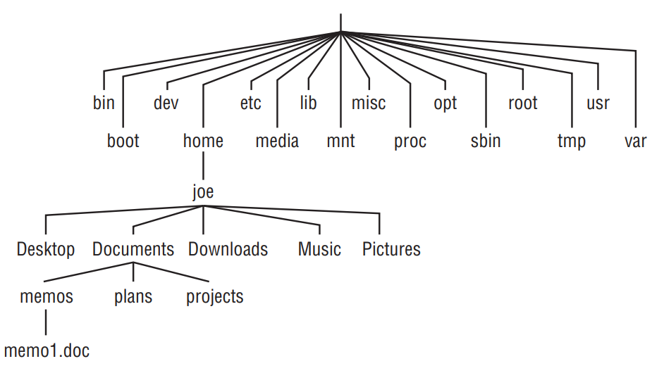

# Essencial de Linux
**Autor: Lucas Albano**

Neste artigo vamos explorar conceitos básicos de sistemas Linux. Além disso, vamos apresentar a distribuição Kali Linux, uma distribuição focada em segurança da informação e testes de penetração.
# Linux

No contexto da cibersegurança, o conhecimento e a compreensão de sistemas operacionais desempenha um papel crucial. Entre as várias opções disponíveis, o Linux se destaca como uma escolha popular entre profissionais de segurança da informação e entusiastas de tecnologia. Esta seção oferece uma visão geral do Linux, desde sua definição até sua relevância no campo da cibersegurança.

## O que é Linux

GNU/Linux é um sistema operacional de código aberto distribuído gratuitamente e pode ser modificado e redistribuído por qualquer pessoa de acordo com os termos da licença GNU General Public License (GPL). Ele oferece uma alternativa viável e poderosa aos sistemas operacionais comerciais, como Windows e macOS. O principal destaque do GNU/Linux é sua flexibilidade e capacidade de personalização, o que o torna uma escolha popular entre desenvolvedores, administradores de sistemas e entusiastas de tecnologia em geral.

Linux foi o nome dado ao núcleo de sistema operacional criado por Linus Torvalds. Por extensão, sistemas operacionais que usam o núcleo Linux são chamados genericamente de Linux. Entretanto, a Free Software Foundation afirma que tais sistemas operacionais são, na verdade, sistemas GNU, e o nome mais adequado para tais sistemas é GNU/Linux, uma vez que grande parte do código-fonte dos sistemas operacionais baseados em Linux são ferramentas do projeto GNU.

O Linux oferece uma ampla variedade de distribuições, conhecidas como "distros", que atendem a diferentes necessidades e preferências dos usuários. Algumas das distros mais populares incluem Ubuntu, Fedora, Debian e CentOS, cada uma com suas próprias características e conjuntos de software.

## Uma Breve História do Linux

O Linux foi criado por Linus Torvalds no início dos anos 90, enquanto ele era um estudante de informática na Universidade de Helsinki, na Finlândia. Torvalds havia se matriculado em um curso de UNIX, e um dos textos obrigatórios era *Operating Systems: Design and Implementation* escrito por Andrew S. Tanenbaum. O livro incluía uma cópia do sistema operacional MINIX de Tanenbaum, no entanto, o licenciamento do MINIX o restringia ao uso educacional. Assim, Torvalds decidiu iniciar um projeto pessoal para desenvolver um kernel similar ao UNIX, mas livre e de código aberto. 

Em 1991, Linus Torvalds lançou a primeira versão oficial do kernel do Linux, a versão 0.02. No ano de 1992, ele mudou a licença do núcleo Linux, de uma licença própria para uma licença livre compatível com a GPL do projeto GNU. Isso atraiu uma comunidade de desenvolvedores entusiastas, que contribuíram para o desenvolvimento do sistema operacional, adicionando novos recursos, corrigindo bugs e adaptando-o para diferentes necessidades e dispositivos.

O Linux rapidamente ganhou popularidade entre os entusiastas de computadores e desenvolvedores de software. Empresas também começaram a adotá-lo, principalmente devido à sua estabilidade, segurança e custo zero de licenciamento. Organizações como a Red Hat, a SUSE e a Canonical desenvolveram distribuições Linux voltadas para o mercado empresarial, oferecendo suporte comercial e serviços adicionais.

Nos anos seguintes, o Linux expandiu-se para uma variedade de dispositivos, desde servidores e supercomputadores até smartphones, eletrodomésticos e dispositivos de Internet das Coisas (IoT). Uma das distribuições mais populares, o Ubuntu, tornou-se especialmente conhecida por sua facilidade de uso e suporte à comunidade.

O sucesso do Linux não se limita apenas ao software. Ele também inspirou uma filosofia de colaboração aberta e compartilhamento de conhecimento, que se tornou fundamental para muitos projetos de código aberto e para a própria cultura da Internet. Hoje, o Linux é uma parte fundamental do panorama da tecnologia, alimentando uma ampla variedade de dispositivos e sistemas em todo o mundo.

## Por que usar Linux?

O uso do Linux no contexto da cibersegurança vai além de uma mera escolha de sistema operacional; é uma decisão estratégica fundamentada em uma série de vantagens e características que o tornam uma plataforma ideal para profissionais e estudantes de cibersegurança.

Primeiramente, o Linux é conhecido pela sua segurança robusta. Sua estrutura de permissões granulares e seu modelo de segurança baseado em princípios de acesso mínimo são essenciais para mitigar ameaças potenciais. Além disso, a comunidade de código aberto que sustenta o Linux está constantemente monitorando e corrigindo vulnerabilidades, garantindo atualizações regulares que fornecem uma maior confiança na integridade do sistema. Isso contrasta com sistemas operacionais proprietários, nos quais os detalhes do código são mantidos em segredo, dificultando a identificação e correção de possíveis brechas de segurança.

Além disso, a vasta gama de ferramentas de segurança disponíveis para o Linux é incomparável. Desde firewalls e sistemas de detecção de intrusões até criptografia e ferramentas de análise forense, o ecossistema do Linux oferece uma variedade de soluções para proteger sistemas e redes contra ameaças cibernéticas. Essas ferramentas são frequentemente desenvolvidas e mantidas pela comunidade de código aberto, garantindo atualizações regulares e suporte contínuo.

Outro aspecto crucial é a flexibilidade e personalização oferecidas pelo Linux. Estudantes de cibersegurança podem criar ambientes de laboratório personalizados, replicando cenários de ataque e defesa para fins de aprendizado e treinamento. A capacidade de personalizar e ajustar o sistema operacional de acordo com as necessidades específicas de segurança de cada projeto ou organização é uma vantagem significativa em um campo onde a adaptabilidade e a agilidade são essenciais.

O Linux também é altamente compatível com uma ampla variedade de hardware, o que é fundamental em ambientes de cibersegurança que frequentemente envolvem o uso de dispositivos e sistemas diversos. Essa interoperabilidade facilita a integração do Linux em infraestruturas existentes e simplifica a implementação de soluções de segurança em uma variedade de contextos.

Em resumo, o Linux oferece uma combinação única de segurança, transparência, flexibilidade e compatibilidade que o torna uma escolha ideal para estudantes e profissionais de cibersegurança. Ao dominar as nuances desse sistema operacional, profissionais e estudantes podem desenvolver habilidades essenciais e contribuir para a construção de um ambiente digital mais seguro e resiliente.

# Kali Linux

O Kali Linux é uma distribuição Linux especializada projetada especificamente para testes de penetração e auditoria de segurança. Ele é desenvolvido e mantido pela Offensive Security, uma empresa de segurança cibernética reconhecida por suas certificações e treinamentos em segurança.

O que distingue o Kali Linux de outras distribuições é sua ampla gama de ferramentas de segurança pré-instaladas e otimizadas para fins de testes de penetração. Essas ferramentas abrangem uma variedade de áreas, incluindo análise de vulnerabilidades, exploração de sistemas, análise forense digital, engenharia reversa e muito mais.

Profissionais de segurança optam por utilizar o Kali Linux por várias razões. Primeiramente, a conveniência de ter um conjunto abrangente de ferramentas de segurança disponíveis em uma única distribuição simplifica significativamente o processo de realização de testes de penetração e auditoria de segurança. Em vez de instalar e configurar cada ferramenta individualmente, o Kali Linux fornece um ambiente pronto para uso, permitindo que os profissionais se concentrem diretamente em suas tarefas de segurança.

Outro aspecto importante é o suporte da comunidade e os recursos educacionais disponíveis para os usuários do Kali Linux. A Offensive Security oferece uma variedade de recursos, incluindo documentação abrangente, fóruns de discussão, blogs e cursos de treinamento, que ajudam os profissionais de segurança a aproveitar ao máximo as capacidades do Kali Linux e a aprimorar suas habilidades em testes de penetração e auditoria de segurança.

Além disso, o Kali Linux é altamente personalizável e pode ser adaptado às necessidades específicas de cada usuário. Os profissionais de segurança podem adicionar ou remover ferramentas conforme necessário, configurar o sistema de acordo com as políticas de segurança da organização e personalizar a interface de usuário para atender às suas preferências individuais.

## Tutorial de Instalação do Kali Linux:

Tutorial oficial para instalação do Kali no VirtualBox: https://www.kali.org/docs/virtualization/install-virtualbox-guest-vm/

**Passo 1: Baixar o Kali Linux**

1. Acesse o site oficial do Kali Linux em https://www.kali.org/get-kali/#kali-platforms e baixe a imagem ISO mais recente do Kali Linux para a plataforma desejada. O Kali possui versões pré-montadas para Máquinas Virtuais e também possui uma distribuição para Windows Subsystem Linux.
### Instalação em Máquina Virtual

**Passo 2: Criar uma nova máquina com o arquivo pré-montado**

2. Extraia o arquivo baixado e crie uma nova máquina virtual em seu software de virtualização a partir deste. O processo exato para criar uma nova máquina virtual pode mudar dependendo da plataforma e software de virtualização utilizado, contudo, não é um processo muito complexo e pode ser facilmente descoberto nos tutoriais oficiais. Tutorial oficial do Virtual Box: (https://www.virtualbox.org/manual/ch01.html#create-vm-wizard). Você também pode desejar alterar as configurações padrões, como memória e CPUs alocadas para a VM. 

**Passo 3: Iniciar o Kali Linux**

3. Após isto, basta iniciar a máquina e tudo já estará pronto. O usuário padrão é `kali` e a senha padrão é `kali`. Para mais detalhes leia a documentação oficial.

> **Dica:** Pode ser necessário configurar o teclado para o padrão brasileiro. Para isto utilize o comando `setxkbmap br abnt2`.

### Instalação em Hardware

**Passo 2: Criar um dispositivo de inicialização**

2. Grave a imagem ISO em um dispositivo de inicialização, como um DVD ou unidade flash USB. Você pode usar ferramentas como Rufus (para Windows) ou Etcher (para Linux e macOS) para criar um dispositivo de inicialização bootável.

**Passo 3: Iniciar o computador a partir do dispositivo de inicialização** 

3. Reinicie o computador e inicie a partir do dispositivo de inicialização que você criou.

**Passo 4: Iniciar o processo de instalação**

4. Uma vez iniciado a partir do dispositivo de inicialização, você será apresentado ao menu de inicialização do Kali Linux. Selecione a opção "Graphical Install" (Instalação Gráfica) e siga as instruções na tela.

**Passo 5: Configurar o sistema**

5. Durante o processo de instalação, você será solicitado a selecionar o idioma, localização, layout do teclado e configurar o nome do host e a senha de root.

**Passo 6: Particionamento do disco**

6. Selecione o método de particionamento de disco que melhor atenda às suas necessidades. Você pode optar por particionamento automático ou manual, dependendo de sua preferência e conhecimento.

**Passo 7: Concluir a instalação**

7. Após configurar todas as opções, o instalador irá copiar os arquivos necessários e configurar o sistema. Uma vez concluído, reinicie o computador e remova o dispositivo de inicialização.

**Passo 8: Iniciar o Kali Linux**

8. Após reiniciar, o Kali Linux estará instalado em seu sistema. Faça login com o nome de usuário e senha que você configurou durante a instalação.

# Interface de Linha de Comando (CLI)

Em sistemas operacionais Linux, a interface de linha de comando (CLI) desempenha um papel crucial na interação com o sistema. Dois componentes principais dessa interação são os terminais e os shells.

## Terminais

Um terminal é uma interface de usuário que permite interagir com um sistema operacional por meio de comandos de texto. Historicamente, os terminais eram dispositivos físicos conectados a mainframes ou minicomputadores por meio de cabos, que exibiam texto e permitiam ao usuário inserir comandos usando um teclado. Eles eram comuns antes do surgimento das interfaces gráficas de usuário (GUIs).

Com o avanço da tecnologia e o surgimento de interfaces gráficas de usuário, os terminais físicos tornaram-se menos comuns. Em vez disso, os sistemas operacionais modernos, como o Linux, macOS e Windows, fornecem emuladores de terminal, que são aplicativos de software que simulam a funcionalidade de um terminal físico em um ambiente gráfico.

Os terminais podem variar em termos de funcionalidades e recursos. Alguns terminais oferecem recursos avançados, como divisão de tela, personalização da aparência e suporte a abas, enquanto outros são mais simples e focados apenas na funcionalidade básica de entrada e saída de texto.

## Shells

O shell é um interpretador de comandos que aceita entrada do usuário em forma de texto e os executa como comandos no sistema operacional. Ele age como uma interface entre o usuário e o núcleo do sistema operacional, interpretando os comandos inseridos pelo usuário e realizando as ações correspondentes.

Existem vários shells disponíveis no Linux, cada um com suas próprias características e funcionalidades. Alguns dos shells mais comuns incluem:

- **Bash (Bourne Again SHell)**: O Bash é o shell padrão na maioria das distribuições Linux e é amplamente utilizado devido à sua poderosa capacidade de scripting e suporte a recursos avançados, como expansão de variáveis e histórico de comandos.
- **Zsh (Z shell)**: O Zsh é um shell alternativo que oferece recursos adicionais em comparação com o Bash, como conclusão de comandos mais inteligente, temas personalizáveis e suporte a plugins.
- **Fish (Friendly Interactive SHell)**: O Fish é conhecido por sua interface amigável e intuitiva, com recursos como conclusão automática de comandos, sugestões interativas e coloração de sintaxe.

Cada shell tem sua própria linguagem de script e conjunto de recursos exclusivos, permitindo que os usuários escolham o que melhor se adapta às suas necessidades e preferências.

> Em resumo, o terminal é a interface de usuário que fornece acesso ao shell, enquanto o shell é o interpretador de comandos responsável por processar os comandos inseridos pelo usuário e executar as ações correspondentes no sistema operacional. Eles trabalham juntos para fornecer uma maneira eficaz de interagir com o sistema operacional por meio de comandos de texto.

# Gerenciador de Pacotes

Os gerenciadores de pacotes são ferramentas essenciais em sistemas operacionais Linux que simplificam o processo de instalação, remoção e atualização de software. Eles automatizam o gerenciamento de dependências e garantem que as versões corretas dos pacotes sejam instaladas para manter o sistema funcionando de forma eficiente e segura.

Existem vários gerenciadores de pacotes disponíveis para diferentes distribuições Linux. Alguns dos mais populares incluem:

1. **APT (Advanced Package Tool)**: O APT é comumente usado em distribuições baseadas no Debian, como o Ubuntu. Ele fornece comandos como `apt-get` e `apt`, que podem ser usados para instalar, remover e atualizar pacotes, além de resolver automaticamente dependências.
2. **YUM (Yellowdog Updater, Modified)**: O YUM é usado principalmente em distribuições baseadas no Red Hat, como Fedora e CentOS. Ele oferece comandos como `yum` e `dnf` (sucessor do YUM), que simplificam a instalação e atualização de software, gerenciamento de repositórios e resolução de dependências.
3. **Pacman**: O Pacman é o gerenciador de pacotes usado no Arch Linux e em suas variantes. Ele permite instalar, remover e atualizar pacotes, além de fornecer um sistema de construção de pacotes para criar e compartilhar software personalizado.

Para instalar um novo aplicativo usando um gerenciador de pacotes, basta executar o comando apropriado seguido pelo nome do pacote. Por exemplo, para instalar o editor de texto "Vim" usando o APT, você pode usar o comando:

```
sudo apt install vim
```

## Atualização do Sistema:

Para manter o sistema atualizado, é importante atualizar regularmente os pacotes instalados. Isso pode ser feito usando o comando de atualização apropriado para o gerenciador de pacotes em uso. Por exemplo, para atualizar todos os pacotes no sistema usando o APT, você pode usar o comando:

```
sudo apt update && sudo apt upgrade
```

O primeiro comando (`apt update`) atualiza a lista de pacotes disponíveis nos repositórios, enquanto o segundo comando (`apt upgrade`) instala as atualizações disponíveis.

# Sistema de Arquivos

Uma das principais propriedades dos sistemas UNIX nos quais o Linux é baseado é que quase tudo que você precisa identificar em seu sistema (dados, comandos, links simbólicos, dispositivos e diretórios) é representado por itens nos sistemas de arquivos. Dominar a localização e a navegação por esses elementos através do shell é fundamental para quem utiliza o Linux.

A organização dos arquivos no Linux segue uma hierarquia de diretórios, na qual cada diretório pode conter tanto arquivos quanto outros diretórios. Para referenciar qualquer arquivo ou diretório, pode-se utilizar um caminho completo (por exemplo, `/home/fireuai/meuarquivo.txt`) ou um caminho relativo (por exemplo, se `/home/fireuai` for o diretório atual, `meuarquivo.txt` seria suficiente).

A estrutura de diretórios no Linux assemelha-se a uma árvore, tendo o diretório raiz representado por uma única barra (`/`). Logo abaixo encontram-se diretórios comuns, como bin, dev, home, lib e tmp. Cada um desses diretórios principais, assim como aqueles adicionados ao diretório raiz, podem conter uma infinidade de subdiretórios.

<p style="text-align: center">
  
</p>

Segue uma breve explicação dos diretórios fundamentais:

- **/** (Raiz): Este é o diretório raiz do sistema de arquivos. Todos os outros diretórios estão contidos dentro dele. É representado por uma barra (`/`) e é o ponto de partida para a hierarquia do sistema de arquivos.

- **/bin** (Binários): Este diretório contém os binários essenciais do sistema, como ls, sort, date e chmod. São os comandos fundamentais necessários para a inicialização e operação do sistema, disponíveis para todos os usuários.

- **/boot** (Inicialização): Contém arquivos necessários para a inicialização do sistema, como o kernel do Linux, arquivos de configuração do bootloader (como o GRUB), entre outros.

- **/dev** (Dispositivos): Contém arquivos de dispositivo que representam interfaces para dispositivos de hardware conectados ao sistema, como discos rígidos, unidades USB, impressoras, etc. Os usuários podem acessar esses dispositivos diretamente por meio desses arquivos de dispositivos; no entanto, os aplicativos geralmente ocultam os nomes reais dos dispositivos dos usuários finais.

- **/etc** (Configurações): Armazena arquivos de configuração do sistema e dos aplicativos. Configurações do sistema, como arquivos de rede, configurações do servidor, entre outros, são encontradas aqui. A maioria desses arquivos são arquivos de texto simples que podem ser editados com qualquer editor de texto se o usuário tiver permissão adequada.

- **/home** : Este diretório contém os diretórios pessoais dos usuários. Cada usuário registrado no sistema terá um diretório correspondente aqui para armazenar seus arquivos pessoais. (O usuário root é uma exceção, usando `/root` como seu diretório inicial.)

- **/media** : O diretório `/media` é usado como ponto de montagem temporário para dispositivos de mídia removíveis, como unidades USB, CDs, DVDs e cartões de memória. Quando um dispositivo removível é conectado ao sistema, ele é automaticamente montado em um subdiretório dentro de `/media`. Por exemplo, se você conectar um pendrive, ele poderá ser montado em `/media/usb` ou um nome similar. Esse diretório fornece um local conveniente para acessar temporariamente o conteúdo desses dispositivos de mídia.

- **/lib** (Bibliotecas): Contém bibliotecas compartilhadas necessárias para os programas do sistema e para a inicialização do sistema.

- **/mnt** (Montagem): Ponto de montagem para dispositivos de armazenamento temporários ou removíveis, como discos rígidos externos, pendrives, CDs, etc. Alguns sistemas Linux inicializáveis ainda usam esse diretório para montar partições de disco rígido e sistemas de arquivos remotos. Muitas pessoas ainda usam este diretório para montar temporariamente sistemas de arquivos locais ou remotos que não são montados permanentemente.

- **/misc** (Miscelânea): O diretório `/misc` não é um diretório padrão no Filesystem Hierarchy Standard (FHS) do Linux. Normalmente, ele é utilizado para armazenar arquivos ou diretórios que não se encaixam em outras categorias específicas. É comum encontrar sistemas onde os administradores usam `/misc` como um local genérico para armazenar arquivos que não possuem uma localização mais apropriada.

- **/opt** (Opcional): Este diretório é usado para instalar pacotes de software adicionais não fornecidos pelos repositórios oficiais da distribuição. É comumente usado por aplicativos comerciais ou de terceiros.

- **/proc** (Processos): Contém informações sobre processos em execução no sistema. Os arquivos neste diretório são usados principalmente para interagir com o kernel e obter informações sobre o sistema e os processos em execução.

- **/root** (Superusuário): Este diretório é o diretório pessoal do superusuário (root) no sistema Linux. Enquanto o diretório `/home` contém os diretórios pessoais dos usuários normais, o diretório `/root` é reservado exclusivamente para o superusuário. O diretório inicial do root não reside abaixo de `/home` por motivos de segurança.

- **/sbin** (Binários do Sistema): Semelhante ao diretório `/bin`, mas contém binários essenciais do sistema destinados apenas para uso pelo superusuário (root).

- **/tmp** (Temporário): Diretório para arquivos temporários. Os arquivos armazenados aqui são geralmente excluídos automaticamente durante a inicialização ou em intervalos regulares.

- **/usr** (Recursos do Usuário): Contém recursos compartilhados, como binários, bibliotecas, arquivos de cabeçalho e documentação para aplicativos do usuário. Este diretório é subdividido em `/usr/bin`, `/usr/lib`, `/usr/include`, entre outros.

- **/var** (Variável): Armazena dados variáveis do sistema, como logs de sistema (`/var/log`), spools de email (`/var/mail`), arquivos de banco de dados temporários (`/var/tmp`), entre outros. Em particular, é aqui que você colocaria os arquivos que você compartilha como um servidor FTP `(/var/ftp`) ou um servidor web (/var/www)``.

## Permissões de Arquivos

As permissões de arquivos no sistema operacional Linux são um aspecto crucial da segurança e da gestão de acesso aos arquivos. Elas determinam quem pode ler, escrever ou executar um arquivo ou diretório. As permissões de um arquivo são exibidas ao listar os arquivos em um diretório e geralmente aparecem como uma série de caracteres, como por exemplo: `drwxr-xr-x`.

Existem três tipos de permissões para arquivos e diretórios:

1. **Leitura (r)**: Permite visualizar o conteúdo de um arquivo ou listar o conteúdo de um diretório. Para diretórios, a permissão de leitura também permite listar o conteúdo do diretório.
2. **Escrita (w)**: Permite modificar ou excluir um arquivo. Para diretórios, a permissão de escrita permite adicionar, modificar ou excluir arquivos no diretório.
3. **Execução (x)**: Permite executar um arquivo como um programa ou acessar um diretório. Para arquivos, a permissão de execução é necessária apenas se o arquivo for um script ou um programa executável. Para diretórios, a permissão de execução permite acessar o conteúdo do diretório.

Além disso, as permissões são definidas para três grupos de usuários:

1. **Proprietário (owner)**: O usuário que criou o arquivo ou diretório. O proprietário tem controle total sobre o arquivo, incluindo a capacidade de alterar suas permissões.
2. **Grupo (group)**: Um grupo de usuários definido pelo sistema. Todos os usuários pertencentes a esse grupo têm as permissões de grupo no arquivo.
3. **Outros (others)**: Todos os outros usuários que não são o proprietário do arquivo e não pertencem ao grupo. Essas são as permissões aplicadas a usuários que não são o proprietário nem fazem parte do grupo.

As permissões são exibidas em um formato composto por 10 caracteres. Os primeiros caracteres indicam o tipo de arquivo (como diretório ou arquivo regular) e os próximos nove caracteres indicam as permissões para o proprietário, grupo e outros usuários, respectivamente.

Por exemplo, considerando `drwxr-xr-x`:

- O `d` no início indica que é um diretório.
- Os próximos três caracteres (`rwx`) indicam as permissões do proprietário (read, write e execute).
- Os próximos três caracteres (`r-x`) indicam as permissões do grupo (read e execute).
- Os últimos três caracteres (`r-x`) indicam as permissões para outros usuários (read e execute).

Para modificar as permissões de um arquivo ou diretório, o comando `chmod` é utilizado. Ele permite adicionar ou remover permissões para o proprietário, grupo e outros usuários, conforme necessário.

# Comandos Úteis

A seguir estão alguns dos comandos utilizados com maior frequência em Linux:

1. **ls**: O comando `ls` é usado para listar o conteúdo de um diretório. Quando executado sem argumentos, lista o conteúdo do diretório atual. Pode ser usado com várias opções para exibir detalhes adicionais, como permissões, propriedade e tamanho dos arquivos.
2. **cd**: O comando `cd` é usado para mudar de diretório. Você pode especificar o diretório de destino como argumento para o `cd`, ou usar `cd` sem argumentos para retornar ao diretório inicial do usuário.
3. **pwd**: O comando `pwd` (print working directory) é usado para imprimir o caminho completo do diretório atual em que você está trabalhando.
4. **mkdir**: O comando `mkdir` é usado para criar um novo diretório. Você precisa fornecer o nome do diretório que deseja criar como argumento.
5. **rmdir**: O comando `rmdir` é usado para remover um diretório vazio. Se o diretório contiver arquivos ou subdiretórios, você precisará usar `rm -r` para excluí-lo recursivamente.
6. **touch**: O comando `touch` é usado para criar um novo arquivo vazio ou atualizar o carimbo de data/hora de um arquivo existente.
7. **rm**: O comando `rm` é usado para excluir arquivos ou diretórios. Tenha cuidado ao usá-lo, pois os arquivos excluídos com `rm` não são movidos para a lixeira e são permanentemente removidos do sistema.
8. **cp**: O comando `cp` é usado para copiar arquivos ou diretórios de um local para outro. Você precisa fornecer o nome do arquivo/diretório de origem e o destino como argumentos.
9. **mv**: O comando `mv` é usado para mover ou renomear arquivos e diretórios. Ele pode ser usado para mover arquivos de um local para outro ou para renomear um arquivo ou diretório existente.
10. **cat**: O comando `cat` é usado para exibir o conteúdo de um ou mais arquivos de texto na saída padrão do terminal. Também pode ser usado para concatenar vários arquivos e exibir o resultado.
11. **grep**: O comando `grep` é usado para pesquisar arquivos por linhas que correspondam a um padrão especificado. É comumente usado com pipelines para filtrar a saída de outros comandos.
12. **man**: O comando `man` é usado para exibir o manual de um comando específico. Ele fornece informações detalhadas sobre como usar o comando, suas opções e exemplos de uso.
13. **chmod**: O comando `chmod` é usado para alterar as permissões de acesso de um arquivo ou diretório. Você pode conceder ou revogar permissões de leitura, gravação e execução para o proprietário, grupo e outros usuários.
14. **chown**: O comando `chown` é usado para alterar o proprietário e/ou grupo de um arquivo ou diretório. Isso é útil para transferir a propriedade de um arquivo para outro usuário ou grupo.
15. **sudo**: O comando `sudo` é usado para executar comandos com privilégios de superusuário (root). Ele permite que usuários autorizados executem tarefas que normalmente exigiriam permissões elevadas.

## Detalhes interessantes para iniciantes:

- **Flag -h**: Em muitos comandos Unix e Linux, a flag `-h` é usada como uma abreviação para "help" (ajuda). Quando usada junto com um comando ela geralmente exibe uma mensagem de ajuda ou uma breve descrição dos argumentos e opções disponíveis para esse comando específico. Esta opção é útil para obter informações rápidas sobre como usar um comando ou suas opções.
- **Flag --help**: A flag `--help` é semelhante à flag `-h`, mas é uma convenção comum em muitos programas Linux para fornecer uma descrição mais detalhada das opções e argumentos disponíveis para o comando. Quando usada, geralmente exibe uma mensagem de ajuda mais abrangente, incluindo exemplos de uso e uma descrição detalhada de todas as opções disponíveis. Por exemplo, você pode usar `ls --help` ou `rm --help` para obter informações detalhadas sobre como usar os comandos `ls` e `rm`, respectivamente.

Em sistemas Linux, as flags que começam com um único traço (-) são frequentemente chamadas de "opções de linha de comando de curto formato", enquanto as que começam com dois traços (--) são conhecidas como "opções de linha de comando de longo formato".

1. **Opções de linha de comando de curto formato (-)**:
    - São frequentemente usadas para opções curtas e geralmente consistem em uma única letra.
    - Podem ser agrupadas para economizar espaço na linha de comando.
    - Por exemplo: `ls -l -a` ou `ls -la`.
2. **Opções de linha de comando de longo formato (--)**:
    - São usadas para opções mais descritivas e autoexplicativas.
    - Normalmente consistem em palavras ou frases, tornando-as mais legíveis.
    - Não podem ser agrupadas.
    - Por exemplo: `ls --all` ou `ls --color=auto`.

Ambas as formas de especificar opções são amplamente aceitas e suportadas na maioria dos programas de linha de comando em sistemas Linux. A escolha entre uma ou outra muitas vezes se resume à preferência pessoal do usuário ou às convenções específicas do programa em questão.

# Conclusão e Sugestões para Aprofundamento

Neste artigo vimos alguns conceitos básicos de sistemas Linux dando ênfase a distro Kali Linux que é a preferida por profissionais de cibersegurança. Deixo por fim algumas sugestões de leituras e vídeos para se aprofundar em sistemas Linux:

- **Negus, C. (2020). _Linux bible_, 10th Edition.**
- **37 principais comandos do Linux: do básico ao avançado**: https://diolinux.com.br/sistemas-operacionais/principais-comandos-do-linux-saiba-o.html
- **Curso de Linux - Primeiros Passos (Curso em Vídeo):** https://www.youtube.com/playlist?list=PLHz_AreHm4dlIXleu20uwPWFOSswqLYbV
- **Canal Diolinux:** https://www.youtube.com/@Diolinux
- **Site Oficial do Linux:** https://www.kernel.org/linux.html


