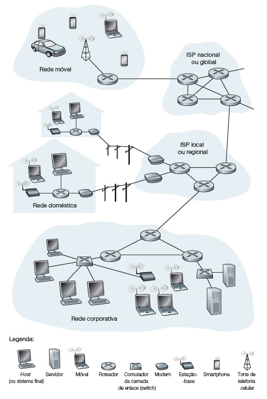
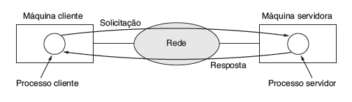
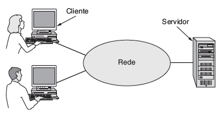
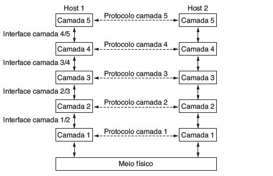
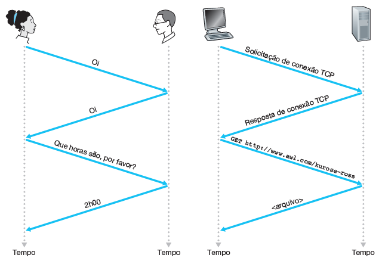
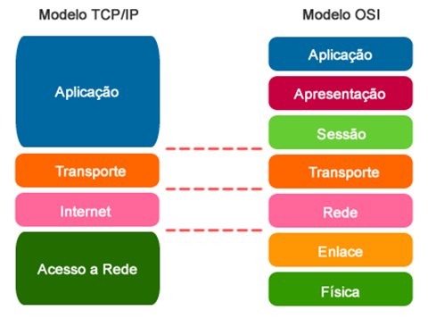

# Introdução à Redes

## O que são Redes de Computadores?

Uma rede de computadores é um conjunto de dispositivos interconectados que são capazes de trocar informações e recursos. Esses dispositivos podem incluir computadores, servidores, dispositivos de rede (como roteadores e switches) e outros equipamentos. A finalidade principal de uma rede de computadores é permitir a comunicação entre os dispositivos, facilitando o compartilhamento de recursos, como arquivos, impressoras e conexão com a internet.

As redes de computadores podem ser classificadas de diversas maneiras, dependendo de seu tamanho, localização geográfica e tipo de tecnologia de comunicação utilizada. Elas podem variar desde pequenas redes domésticas (*Local Area Network* - LAN) até grandes redes corporativas ou até mesmo redes globais (*Wide Area Network* - WAN), como a internet. As redes podem ser cabeadas, utilizando cabos físicos para a transmissão de dados, ou sem fio, utilizando tecnologias como Wi-Fi e Bluetooth.

### Internet

A Internet é uma rede de computadores que interconecta centenas de milhões de dispositivos de computação ao redor do mundo. Na verdade, o termo rede de computadores está começando a soar um tanto desatualizado, dados os muitos equipamentos não tradicionais que estão sendo ligados à Internet. A Internet pode ser descrita como uma rede de redes, onde cada rede individual pode ter sua própria estrutura e propósito, mas todas estão interligadas e podem se comunicar umas com as outras. Essas redes podem ser redes locais em empresas ou residências, data centers e até mesmo redes de dispositivos da Internet da Coisa (IoT) como geladeiras, câmeras e lâmpadas inteligentes, todas conectadas por meio de Provedores de Serviços de Internet (*Internet Service Providers* - ISPs). ISPs geralmente são empresas de TV a cabo ou telefonia, universidades, entre outros.

    

Um aspecto fundamental da Internet é a sua abertura e descentralização. Não existe uma única entidade ou organização que controle a Internet como um todo. Em vez disso, ela é composta por uma infinidade de provedores de serviços, empresas, organizações sem fins lucrativos e indivíduos que contribuem para a sua operação e desenvolvimento. Esta descentralização é parte do que torna a Internet resiliente e flexível, permitindo sua adaptação a novas tecnologias e desafios ao longo do tempo.

Além disso, a Internet é uma plataforma para uma ampla gama de serviços e aplicativos, desde comunicação e colaboração até comércio eletrônico, entretenimento e educação. Através da Internet, as pessoas podem se conectar, compartilhar ideias, acessar informações e recursos, realizar transações comerciais e muito mais, em qualquer lugar e a qualquer momento, desde que tenham acesso a uma conexão com a rede.

## Infraestrutura de rede

A infraestrutura de rede é o conjunto de componentes físicos e lógicos que permitem a comunicação e o compartilhamento de recursos entre dispositivos conectados em uma rede. Esses componentes incluem dispositivos de hardware, como roteadores, switches, cabos e servidores, além de software de rede e protocolos de comunicação.

Um dos paradigmas fundamentais na infraestrutura de rede é o modelo cliente-servidor. Nesse modelo, os dispositivos na rede são geralmente divididos em dois tipos: clientes e servidores. Os clientes são dispositivos que solicitam serviços ou recursos da rede, enquanto os servidores são dispositivos que fornecem esses serviços ou recursos em resposta às solicitações dos clientes.

    

Por exemplo, em uma rede de computadores em uma empresa, os funcionários podem usar seus computadores (clientes) para acessar arquivos armazenados em um servidor de arquivos. Neste caso, o cliente envia uma solicitação ao servidor para acessar o arquivo desejado, e o servidor responde fornecendo o arquivo solicitado.

    

A arquitetura cliente-servidor oferece vantagens significativas em termos de escalabilidade, flexibilidade e segurança. Os servidores centralizam recursos e dados, facilitando a administração e o gerenciamento da rede. Além disso, esse modelo permite que os clientes acessem recursos compartilhados de forma eficiente e segura.

A infraestrutura de rede também pode incluir outros modelos de comunicação, como redes ponto a ponto, onde os dispositivos se comunicam diretamente entre si sem a necessidade de um servidor central. No entanto, o modelo cliente-servidor continua sendo um dos pilares fundamentais da infraestrutura de rede moderna, utilizado em uma ampla gama de cenários, desde redes empresariais até a internet em larga escala.

### Pacotes

Pacotes são unidades de dados organizadas e estruturadas que são transmitidas através de redes de computadores. Eles contêm informações que são enviadas de um dispositivo para outro na rede e são essenciais para a comunicação eficiente entre os dispositivos.

Cada pacote contém dois tipos principais de informações: os dados reais que estão sendo transmitidos e os metadados que descrevem como os dados devem ser entregues. Os metadados incluem informações como o endereço de origem e destino do pacote, o tipo de protocolo usado, o número de sequência, entre outros.

Uma das principais vantagens do uso de pacotes é a capacidade de transmitir dados de forma eficiente e confiável em redes de diferentes tipos e tamanhos. Dividir os dados em pacotes menores permite que a rede lide com grandes volumes de dados de forma mais eficiente, além de possibilitar que diferentes tipos de tráfego compartilhem o mesmo meio de comunicação.

## Arquitetura de Redes

Para reduzir a complexidade de seu projeto, a maioria das redes é organizada como uma pilha de camadas (ou níveis), colocadas umas sobre as outras. O número, o nome, o conteúdo e a função de cada camada diferem de uma rede para outra. No entanto, em todas as redes o objetivo de cada camada é oferecer determinados serviços às camadas superiores, isolando essas camadas dos detalhes de implementação real desses recursos. Em certo sentido, cada camada é uma espécie de máquina virtual, oferecendo determinados serviços à camada situada acima dela.

    

Todas as atividades na Internet que envolvem duas ou mais entidades remotas comunicantes são governadas por um protocolo. Basicamente, um protocolo é um acordo entre as partes que se comunicam, estabelecendo como se dará a comunicação. Por exemplo, protocolos executados no hardware de dois computadores conectados fisicamente controlam o fluxo de bits no “cabo” entre as duas placas de interface de rede; protocolos de controle de congestionamento em sistemas finais controlam a taxa com que os pacotes são transmitidos entre a origem e o destino; protocolos em roteadores determinam o caminho de um pacote da origem ao destino.

> Um protocolo define o formato e a ordem das mensagens trocadas entre duas ou mais entidades comunicantes, bem como as ações realizadas na transmissão e/ou no recebimento de uma mensagem ou outro evento.

Como exemplo de um protocolo de rede de computadores com o qual você provavelmente está familiarizado, considere o que acontece quando fazemos uma requisição a um servidor Web, isto é, quando digitamos o URL de uma página Web no browser. Primeiro, o computador enviará uma
mensagem de requisição de conexão ao servidor Web e aguardará uma resposta. O servidor receberá essa mensagem de requisição de conexão e retornará uma mensagem de resposta de conexão. Sabendo que agora está tudo certo para requisitar o documento da Web, o computador envia então o nome da página Web que quer buscar naquele servidor com uma mensagem GET. Por fim, o servidor retorna a página (arquivo) para o computador.

    

Um conjunto de camadas e protocolos é chamado **arquitetura de rede**. A especificação de uma arquitetura deve conter informações suficientes para permitir que um implementador desenvolva o programa ou construa o hardware de cada camada de forma que ela obedeça corretamente ao protocolo adequado. Nem os detalhes da implementação nem a especificação das interfaces pertencem à arquitetura, pois tudo fica oculto dentro das máquinas e não é visível do exterior. Nem sequer é necessário que as interfaces de todas as máquinas de uma rede sejam iguais, desde que cada uma delas possa usar todos os protocolos da maneira correta.

## Modelo OSI e TCP/IP

Citamos que a maioria das redes é organizada como uma pilha de camadas para reduzir sua complexidade. Portanto, iremos destacar duas importantes arquiteturas de rede: os modelos de referência OSI e TCP/IP. Embora os protocolos associados ao modelo OSI raramente sejam usados nos dias de hoje, o modelo em si é de fato bastante geral e ainda válido, e as características descritas em cada camada ainda são muito importantes. O modelo TCP/IP tem características opostas: o modelo propriamente dito não é muito utilizado, mas os protocolos são bastante utilizados. Ambos se baseiam no conceito de uma pilha de protocolos independentes. Além disso, as camadas têm praticamente as mesmas funcionalidades. Por exemplo, em ambos os modelos estão presentes as camadas que englobam até a camada de transporte para oferecer um serviço de transporte de ponta a ponta, independente da rede, a processos que desejam se comunicar.

    

O **Modelo OSI** (Open Systems Interconnection) é um modelo de referência que descreve e padroniza a comunicação entre sistemas de computadores em uma rede. Desenvolvido pela International Organization for Standardization (ISO) no fim da década de 1970, o Modelo OSI é dividido em sete camadas, cada uma com funções específicas e bem definidas.

1. **Camada Física**: A camada física lida com a transmissão física dos dados pela rede. Ela define as características elétricas, mecânicas e funcionais dos dispositivos de rede, como cabos, conectores e sinais elétricos.
2. **Camada de Enlace de Dados**: Esta camada é responsável pela comunicação direta entre dispositivos adjacentes na rede. Ela garante uma comunicação confiável, controla o acesso ao meio físico e trata erros de transmissão.
3. **Camada de Rede**: A camada de rede gerencia o roteamento dos dados através da rede. Ela determina o melhor caminho para os dados viajarem de um ponto a outro, utilizando algoritmos de roteamento e endereçamento.
4. **Camada de Transporte**: A camada de transporte fornece serviços de comunicação fim a fim para os aplicativos. Ela segmenta, reagrupa e controla o fluxo de dados para garantir uma transmissão confiável e eficiente.
5. **Camada de Sessão**: A camada de sessão estabelece, gerencia e encerra sessões de comunicação entre os aplicativos. Ela sincroniza a comunicação entre os dispositivos e lida com a recuperação de falhas de sessão.
6. **Camada de Apresentação**: Esta camada trata da representação dos dados, garantindo que eles sejam interpretados corretamente pelos aplicativos. Ela lida com a codificação, compressão e criptografia dos dados.
7. **Camada de Aplicação**: A camada de aplicação é a camada mais alta do modelo OSI e fornece serviços de rede diretamente aos aplicativos do usuário. Ela inclui protocolos de aplicação, como HTTP, SMTP e FTP, que permitem a comunicação e o compartilhamento de informações entre os usuários.

O **Modelo TCP/IP** (Transmission Control Protocol/Internet Protocol) ao contrário do Modelo OSI, que possui sete camadas, é composto por quatro camadas principais, oferecendo uma abordagem mais simplificada para a comunicação em rede.

1. **Camada de Interface de Rede**: Também conhecida como Camada de Acesso à Rede, esta é a camada mais baixa do Modelo TCP/IP. Ela lida com a comunicação entre o dispositivo de rede e o meio físico, como cabos Ethernet ou conexões sem fio. Nesta camada, são especificados protocolos como o Ethernet e Wi-Fi.
2. **Camada de Internet**: Esta camada é responsável pelo roteamento dos pacotes de dados através da rede. Ela utiliza endereços IP para identificar os dispositivos na rede e determina a rota para os pacotes viajarem do remetente para o destinatário. O protocolo principal nesta camada é o IP (Internet Protocol), que é o protocolo fundamental da Internet.
3. **Camada de Transporte**: A camada de transporte fornece comunicação fim a fim entre os aplicativos na rede. Ela divide os dados em pacotes menores, se necessário, e fornece controle de fluxo e correção de erros para garantir uma transmissão confiável. Os protocolos principais nesta camada são o TCP (Transmission Control Protocol), que oferece uma comunicação confiável e orientada à conexão, e o UDP (User Datagram Protocol), que oferece uma comunicação mais rápida e não confiável.
4. **Camada de Aplicação**: Esta é a camada mais alta do Modelo TCP/IP e engloba uma variedade de protocolos de aplicação. Ela fornece serviços de rede diretamente aos aplicativos do usuário, como navegação na web (HTTP), transferência de arquivos (FTP), envio de e-mails (SMTP) e resolução de nomes de domínio (DNS).

## Principais Protocolos

### Internet Protocol - IP

O Protocolo de Internet (*Internet Protocol* - IP) é um dos principais protocolos de comunicação das redes de computadores modernas. Ele é responsável por fornecer a identificação e o endereçamento dos dispositivos na rede, bem como o roteamento dos pacotes de dados de um ponto a outro.

O IP opera na camada de rede do Modelo OSI e utiliza um sistema de endereçamento único, conhecido como endereço IP, para identificar cada dispositivo conectado à rede. Os endereços IP são compostos por uma sequência de números binários, geralmente expressos em formato decimal separado por pontos, como por exemplo, "192.0.2.1".

Existem duas versões principais do Protocolo de Internet em uso atualmente: IPv4 e IPv6. O IPv4 é a versão original do protocolo e utiliza endereços de 32 bits, o que permite um total de aproximadamente 4,3 bilhões de endereços únicos. No entanto, devido ao crescimento explosivo da Internet, o espaço de endereçamento IPv4 está se esgotando, levando ao desenvolvimento do IPv6.

O IPv6 é uma versão mais recente do Protocolo de Internet, projetada para resolver o problema de escassez de endereços do IPv4. Ele utiliza endereços de 128 bits, proporcionando um espaço de endereçamento muito maior, teoricamente capaz de suportar um número quase ilimitado de dispositivos conectados à Internet.

### TCP e UDP

Os protocolos TCP (*Transmission Control Protocol*) e UDP (*User Datagram Protocol*) são dois dos principais protocolos da camada de transporte utilizados em redes de computadores.

O TCP é um protocolo orientado à conexão e confiável, projetado para garantir que os dados sejam entregues de forma ordenada, sem erros, e com confirmação de recebimento. Ele divide os dados em segmentos e estabelece uma conexão antes de iniciar a transferência de dados. Durante a transmissão, o TCP monitora o fluxo de dados, retransmitindo pacotes perdidos ou danificados e garantindo que eles cheguem ao destino corretamente. Isso faz com que o TCP seja ideal para aplicativos que exigem uma transmissão precisa e completa dos dados, como transferências de arquivos, acesso remoto e navegação na web.

Por outro lado, o UDP é um protocolo mais simples e sem conexão, projetado para uma comunicação mais rápida e eficiente. Ele não possui mecanismos de confirmação de recebimento ou retransmissão de pacotes perdidos, o que o torna mais adequado para aplicativos que priorizam a velocidade e a eficiência em detrimento da confiabilidade absoluta. Exemplos de aplicativos que utilizam o UDP incluem streaming de vídeo e áudio, jogos online e transmissão de dados em tempo real.

Embora o TCP e o UDP tenham diferentes abordagens para a transmissão de dados, ambos são essenciais para a comunicação em redes de computadores. A escolha entre TCP e UDP depende das necessidades específicas de cada aplicativo, levando em consideração fatores como confiabilidade, velocidade, complexidade e exigências de latência. Em muitos casos, os aplicativos podem utilizar ambos os protocolos, dependendo do tipo de dado a ser transmitido e das condições da rede.

### DNS

O Sistema de Nomes de Domínio (DNS - *Domain Name System*) é um dos componentes essenciais da infraestrutura da Internet, responsável por traduzir nomes de domínio amigáveis, como "exemplo.com", em endereços IP numéricos, como "192.0.2.1", que são utilizados pelos computadores para se comunicarem na rede.

Sem o DNS, os usuários teriam que memorizar e utilizar endereços IP numéricos para acessar sites e recursos online, o que seria impraticável. O DNS simplifica esse processo ao fornecer um sistema hierárquico de nomes de domínio que é mais fácil de ser lembrado e utilizado pelos humanos.

O funcionamento do DNS é baseado em uma estrutura distribuída de servidores de nomes, que são responsáveis por armazenar e fornecer informações sobre os nomes de domínio e seus respectivos endereços IP. Existem vários tipos de servidores de nomes, incluindo servidores de nomes raiz, servidores de nomes de domínio de alto nível (TLD), servidores de nomes autoritativos e servidores de nomes recursivos.

Quando um usuário digita um nome de domínio em seu navegador da web, o computador realiza uma consulta DNS para encontrar o endereço IP correspondente. Essa consulta é processada em várias etapas, começando com os servidores de nomes raiz, que direcionam a consulta para os servidores de nomes responsáveis pelo domínio específico. Finalmente, o endereço IP correspondente é retornado ao computador do usuário, permitindo que a comunicação ocorra.

### HTTP

O Protocolo de Transferência de Hipertexto (HTTP - *Hypertext Transfer Protocol*) é um dos principais protocolos de comunicação utilizados na *World Wide Web*. Ele define as regras e convenções para a transferência de dados entre um cliente (geralmente um navegador da web) e um servidor web.

O HTTP opera no nível de aplicação do Modelo OSI e é baseado no modelo de requisição e resposta. Isso significa que, quando um cliente deseja acessar um recurso (como uma página da web) em um servidor, ele envia uma requisição HTTP ao servidor especificando o recurso desejado. O servidor, por sua vez, responde à requisição enviando os dados solicitados de volta ao cliente.

Uma das características distintivas do HTTP é o seu formato de mensagem simples, composto por um cabeçalho e, opcionalmente, um corpo de mensagem. O cabeçalho contém informações sobre a requisição ou resposta, como o método de requisição (GET, POST, PUT, DELETE), o tipo de conteúdo, o código de status e outras metainformações. O corpo da mensagem pode conter os dados propriamente ditos, como o conteúdo de uma página da web ou os parâmetros de um formulário HTML.

O HTTP é um protocolo sem estado, o que significa que cada requisição é tratada de forma independente e não mantém informações sobre requisições anteriores. Isso permite uma comunicação mais simples e eficiente entre o cliente e o servidor, mas também pode limitar a capacidade de manter o estado da sessão entre requisições.

Ao longo dos anos, o HTTP evoluiu através de diferentes versões, com melhorias de desempenho, segurança e funcionalidade. As versões mais recentes, como HTTP/1.1 e HTTP/2, introduziram recursos como compressão de dados, multiplexação de requisições e respostas, e suporte a criptografia SSL/TLS para garantir a segurança das comunicações.

## Vulnerabilidades

As redes de computadores são um serviço essencial nos dias de hoje. No entanto, elas apresentam várias vulnerabilidades que podem ser exploradas por indivíduos mal-intencionados com o objetivo de obter dados confidenciais ou negar o acesso a algum serviço. Um simples exemplo de vulnerabilidade é perceptível ao se notar a facilidade de criar um pacote com qualquer endereço de origem, conteúdo de pacote e endereço de destino e transmiti-lo para a Internet, que sem nenhum problema o encaminhará ao destino. A capacidade de introduzir pacotes na Internet com um endereço de origem falso é conhecida como IP *spoofing*, e é uma das muitas maneiras pelas quais um usuário pode se passar por outro.

Além disso, serviços de rede, como servidores web, servidores de e-mail e servidores de arquivos, frequentemente contêm falhas de segurança que podem ser exploradas por atacantes para obter acesso não autorizado aos sistemas ou roubar informações sensíveis. Por exemplo, vulnerabilidades em servidores web podem permitir ataques de SQL *injection* ou *cross-site scripting* (XSS).

Também, Redes Wi-Fi são frequentemente alvo de ataques devido à sua natureza sem fio e à falta de segurança adequada. Atacantes podem usar técnicas como sniffing, spoofing e cracking de senhas para comprometer redes Wi-Fi e acessar dados sensíveis.

Outro ponto preocupante são os dispositivos IoT, como câmeras de segurança, termostatos inteligentes e dispositivos médicos conectados à Internet. Esses dispositivos frequentemente têm falhas de segurança que podem ser exploradas por invasores para acesso não autorizado ou controle remoto. Por exemplo, senhas padrão fracas ou falta de atualizações de segurança podem deixar os dispositivos vulneráveis a infecção por malwares construtores de *botnets*.

Os Ataques de Negação de Serviço (DoS) são uma forma de impedir o acesso a determinado recurso ou serviço por meio da sobrecarga de um dispositivo ou rede. Essa sobrecarga torna o serviço inacessível para usuários legítimos, causando uma negação de serviço. Por sua vez, o ataque de negação de serviço distribuído (DDoS) é realizado por uma rede de dispositivos comprometidos, as *botnets* anteriormente citadas, que são controlados remotamente pelo atacante. Os dispositivos na *botnet* podem incluir computadores, servidores, dispositivos IoT e até mesmo dispositivos móveis. O objetivo de um ataque DDoS pode variar, desde prejudicar a reputação de uma empresa até extorquir dinheiro por meio de resgate ou simplesmente interromper as operações de uma organização.

Um ataque de *Man-in-the-Middle* (MitM) ocorre quando um invasor intercepta e modifica comunicações entre duas partes, sem o conhecimento ou consentimento delas. O atacante se posiciona entre o remetente e o destinatário e pode ler, modificar ou até mesmo injetar novos dados na comunicação. Este tipo de ataque pode ser realizado em diferentes cenários, como redes Wi-Fi não seguras, redes com fio comprometidas, ou até mesmo em comunicações criptografadas, se o atacante tiver acesso às chaves de criptografia. Os ataques de homem-no-meio podem ser usados para capturar informações confidenciais, como senhas ou informações de cartão de crédito, realizar alterações em transações financeiras, ou até mesmo redirecionar o tráfego para sites falsos para realizar phishing.

Existem várias outras vulnerabilidades específicas de redes, portanto, é importante manter-se atualizado sobre as melhores práticas de segurança e adotar uma postura proativa na proteção das redes e dos sistemas contra esses tipos de ameaças. 

## Referências

TANENBAUM, Andrew S. Redes de computadores. Pearson.
KUROSE, J.F. Redes de Computadores e a Internet: uma abordagem top-down. Pearson.
